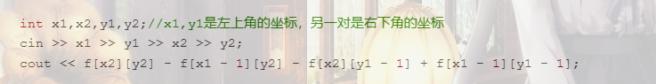
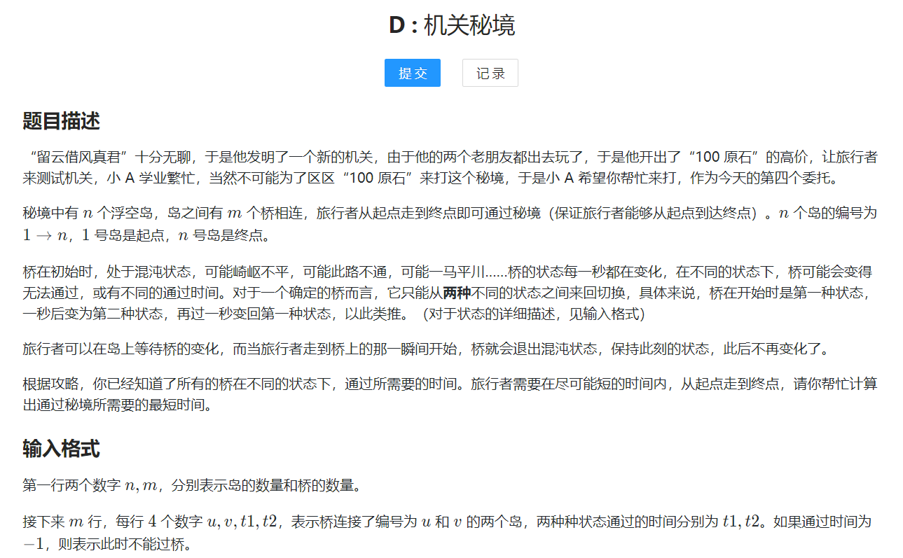

# scanf printf 输入输出优化

```c++
double :%lf

long long:%lld
    
    ios::sync_with_stdio(false);
    cin.tie(0);
    cout.tie(0);

用"\n"而不是endl
    
    
```


# mod运算

```
a+b: (a%MOD+b%MOD)%MOD
a-b: ((a-b)%MOD+MOD)%MOD
```


# 前缀和

## 一维


## 二维



# 差分


# 二分

## 第一种

```c++
int main()
{
	int l;
	int r;
	while(l < r)
	{
		int mid = (l + r)/ 2;
		if(check())
		{
			r = mid;  // 这里是 r = mid, 说明[l,mid]是合法范围
		}
		else
		{
			l = mid + 1;   //  [l,mid]这个范围都不是合法范围，所以下一次查找直接从 l = mid + 1开始了
		}
		//最后的l,r是答案 因为 l == r ，最终就是答案。
	} 		

}

```


## 第2种

```c++
int main()
{
	int l;
	int r;
	while(l < r)
	{
		int mid = (l + r + 1)/ 2;  // 这里要 l + r +1 要不然会死循环
		if(check())
		{
			l = mid;         // mid这个位置 满足条件之后 查找 [mid , right]的位置， 所以l移到mid的位置
		}
		else
		{
			r = mid - 1;     // [mid,r] 不满足条件， 所以要移到满足条件的一方， r = mid - 1 
		}
	} 
	//最后的l,r是答案 因为 l == r


}

```


# 单调栈

```c++
#include <bits/stdc++.h>
using namespace std;
#define int long long
const int N = 1e5 + 5;
int a[N];
int l[N];
int r[N];
int n;
stack<pair<int, int>>s1;
stack<pair<int, int>>s2;
int ans;
signed main()
{
    cin >> n;
    for (int i = 1; i <= n; i++)
    {
        cin >> a[i];
    }
    for (int i = 1; i <= n; i++)
    {
        while (!s1.empty()&&s1.top().second>=a[i])//左边第一个小于它的
        {
            s1.pop();
        }

        if (s1.empty())
        {
            l[i] = 0;
        }
        else
        {
            l[i] = s1.top().first;
        }
        s1.push({ i,a[i] });
    }
    for (int i = n; i ; i--)
    {
        while (!s2.empty() && s2.top().second >= a[i])
        {
            s2.pop();
        }

        if (s2.empty())
        {
            r[i] = n+1;
        }
        else
        {
            r[i] = s2.top().first;
        }
        s2.push({ i,a[i] });
    }

    for (int i = 1; i <= n; i++)
    {
        int l1 = l[i] + 1;
        int r1 = r[i] - 1;
        
        int length = r1 - l1 + 1;

        ans = max(ans, length * a[i]);
    }
    cout << ans;
    


    return 0;
}
```


# kruskal

```c++
#include <bits/stdc++.h>
using namespace std;
#define int long long
const int N=4e5+50;
struct edge
{
    int a,b,w;
    bool operator<(const edge&e)
    {
        return w<e.w;
    }
};
edge e[N];

int fa[N];

int find(int u)
{
    if (u!=fa[u])
    {
        fa[u]=find(fa[u]);
    }
    return fa[u];
}
void merge(int a,int b)
{
    a=find(a);
    b=find(b);

    fa[a]=b;
}
int n,m;
void kruskal()
{
    for(int i=1;i<=n;i++)
    {
        fa[i]=i;
    }
    int cnt=0;
    int ans=0;
    sort(e+1,e+1+m);
    for(int i=1;i<=m;i++)
    {
        int a=e[i].a;
        int b=e[i].b;
        if (find(a)!=find(b))
        {
            ans+=e[i].w;
            merge(a,b);
            cnt++;
        }
    }
//    cout<<cnt<<endl;
    if (cnt==n-1)
    {
        cout<<ans<<endl;
    }
    else
    {
        cout<<"impossible"<<endl;
    }

}
signed main()
{
    cin>>n>>m;
    for(int i=1;i<=m;i++)
    {
        cin>>e[i].a>>e[i].b>>e[i].w;
    }
    kruskal();

    return 0;
}
```


# prim

```c++
#include <bits/stdc++.h>
using namespace std;
const int N=2*500+10;
int g[N][N];
int n,m;
const int INF=0x3f3f3f3f;
const int fill_val=0x3f;
bool vis[N];
int dis[N];
int ans;
void prim()
{
    memset(dis,fill_val,sizeof dis);
    dis[1]=0;
    for(int i=0;i<n;i++)
    {
        int t=-1;
        for(int j=1;j<=n;j++)
        {
            if(!vis[j]&&(t==-1||dis[j]<dis[t]))
            {
                t=j;
            }
        }
        if(dis[t]==INF)
        {
            printf("impossible");
            return;
        }
        ans+=dis[t];
        vis[t]= true;

        for(int j=1;j<=n;j++)
        {
            dis[j]=min(dis[j],g[t][j]);
        }
    }
    printf("%d",ans);
}
int main()
{
    scanf("%d%d",&n,&m);
    /*for(int i=1;i<=n;i++)
    {
        for(int j=1;j<=n;j++)
        {
            if(i!=j)
            {
                g[i][j]=INF;
            }
        }
    }*/
    memset(g,fill_val,sizeof g);
    for(int i=0;i<m;i++)
    {
        int u,v,w;
        scanf("%d%d%d",&u,&v,&w);
        g[v][u]=g[u][v]=min(g[u][v],w);
    }
    prim();


    return 0;
}
```


# dijkstra

```c++
#include <bits/stdc++.h>
using namespace std;
#define int long long
const int N=2e5+50;
//int belong[N];
//vector<int>block[N];
int d[N];
bool vis[N];
int h[N];
int ne[N];
int w[N];
int target[N];
int idx=1;
void add(int a,int b,int c)
{
    target[idx]=b;
    w[idx]=c;
    ne[idx]=h[a];
    h[a]=idx++;
}
int n,m;
#define pii pair<int,int>
void dijkstra()
{
    memset(d,0x3f,sizeof d);
    d[1]=0;
    priority_queue<pii,vector<pii>,greater<pii>>q;

    q.push({0,1});
    while (!q.empty())
    {
        auto t=q.top();
        q.pop();
        int v=t.second,dis=t.first;

        if (vis[v])
        {
            continue;
        }
        vis[v]= true;

        for(int i=h[v];i;i=ne[i])
        {
            int j=target[i];
            if (d[v]+w[i]<d[j])
            {
                d[j]=d[v]+w[i];
                q.push({d[j],j});
            }
        }
    }

    if (d[n]>0x3f3f3f3f)
    {
        cout<<-1<<endl;
    }
    else
    {
        cout<<d[n]<<endl;
    }

}
signed main()
{
    cin>>n>>m;
    for(int i=0;i<m;i++)
    {
        int x,y,z;
        cin>>x>>y>>z;
        add(x,y,z);
    }

    dijkstra();


    return 0;
}
```


# spfa最短路

```c++
#include <bits/stdc++.h>
using namespace std;
#define int long long

int n, m;
const int N = 2e5 + 50;
int dis[N];
bool vis[N];
vector<pair<int, int>>to[N];// dest val
void add(int a, int b, int c)
{
    to[a].push_back({ b,c });
}

void spfa()
{
    memset(dis, 0x3f, sizeof dis);
    dis[1] = 0;
    queue<int>q;
    q.push(1);
    while (!q.empty())
    {
        auto t = q.front();
        q.pop();
        vis[t] = false;
        for (auto& i : to[t])
        {
            int w = i.second;
            int dest = i.first;
            if (dis[t] + w < dis[dest])
            {
                dis[dest] = dis[t] + w;
                if (!vis[dest])
                {
                    vis[dest] = true;
                    q.push(dest);
                }
            }
        }
    }

    if (dis[n] > 0x3f3f3f3f)
    {
        cout << "impossible";
    }
    else
    {
        cout << dis[n];
    }
    cout << endl;

}
signed main()
{
    cin >> n >> m;
    for (int i = 0; i < m; i++)
    {
        int x, y, z;
        cin >> x >> y >> z;
        add(x, y, z);

    }
    spfa();

    return 0;
}
```


# spfa求负环

```c++
#include <bits/stdc++.h>
using namespace std;
const int N=20000+50;
int n;
int w[N],h[N],ne[N],target[N];
int idx=1;
bool vis[N];
int dis[N];
void add(int a,int b,int c)
{
    w[idx]=c;
    target[idx]=b;
    ne[idx]=h[a];
    h[a]=idx++;
}
int m;
int cnt[N];
const int fill_val=0x3f;
const int INF=0x3f3f3f3f;
void spfa()
{
    memset(dis,fill_val,sizeof dis);
    dis[1]=0;
    queue<int>q;
    for(int i=1;i<=n;i++)
    {
        q.push(i);
        vis[i]= true;
    }
    while (!q.empty())
    {
        auto t=q.front();
        q.pop();
        vis[t]= false;
        for(int i=h[t];i;i=ne[i])
        {
            int j=target[i];
            if(dis[t]+w[i]<dis[j])
            {
                dis[j]=dis[t]+w[i];
                cnt[j]=cnt[t]+1;
                if(cnt[j]>=n)
                {
                    printf("Yes");
                    return;
                }
                if(!vis[j])
                {
                    q.push(j);
                }
            }
        }
    }
    printf("No");
}
int main()
{
    scanf("%d%d",&n,&m);
    for(int i=0;i<m;i++)
    {
        int x,y,z;
        scanf("%d%d%d",&x,&y,&z);
        add(x,y,z);
    }
    spfa();

    return 0;
}

```


# kosaraju求强联通分量

```c++
#include <bits/stdc++.h>
using namespace std;
const int N = 2e6 + 50;
vector<int>g1[N];
vector<int>g2[N];
int scc_id;//强联通分量的id
int belong[N];//属于那个强联通
int br[N];//退出序列
int n, m;
int in[N];
bool vis1[N];
bool vis2[N];
int br_cnt;
void dfs1(int u)
{
    for (auto& i : g1[u])
    {
        if (!vis1[i])
        {
            vis1[i] = true;
           
            dfs1(i);
        }
    }
    br[++br_cnt] = u;
}

void dfs2(int u)
{
    for (auto& i : g2[u])
    {
        if (!vis2[i])
        {
            vis2[i] = true;
            belong[i] = scc_id;
            dfs2(i);
        }
    }
}

void kosaraju()
{
    for (int i = 1; i <= n; i++)
    {
        if (!vis1[i])
        {
            vis1[i] = true;
            dfs1(i);
        }
    }

    for (int i = n; i; i--)
    {
        int j = br[i];
        if (!vis2[j])
        {
            vis2[j] = true;
            scc_id++;
            belong[j] = scc_id;
            dfs2(j);
        }
    }

    for (int i = 1; i <= n; i++)
    {
        for (auto& j : g1[i])
        {
            if (belong[i]!=belong[j])
            {
                in[belong[j]]++;
            }
        }
    }
    int ans = 0;
    for (int i = 1; i <= scc_id; i++)
    {
        if (!in[i])
        {
            ans++;
        }
    }
    cout << ans;

    
int main()
{
    cin >> n >> m;
    for (int i = 0; i < m; i++)
    {
        int a, b;
        cin >> a >> b;
        g1[a].push_back(b);
        g2[b].push_back(a);
    }
    kosaraju();

     
    return 0;
}
```


# 树状数组

```c++
#include <bits/stdc++.h>
using namespace std;
#define int long long
const int N=10e5+50;
int a[N];
int s[N];
int n,m;
int lb(int v)
{
    return -v&v;
}
int getAnswer(int pos)
{
    int ans=0;
    for(int i=pos;i;i-=lb(i))
    {
        ans+=s[i];
    }
    return ans;
}
void update(int pos,int v)
{
    for(int i=pos;i<=n;i+=lb(i))
    {
        s[i]+=v;
    }
}
signed main()
{
    ios::sync_with_stdio(false);
    cin>>n>>m;
    for(int i=1;i<=n;i++)
    {
        int val;
        cin>>val;
        update(i,val);
    }
    for(int i=0;i<m;i++)
    {
        int flag,x,y;
        cin>>flag>>x>>y;
        if (flag==1)
        {
            update(x,y);
        }
        else
        {
            cout<<getAnswer(y)-getAnswer(x-1)<<endl;
        }
    }


    return 0;
}

```


# 线段树

```c++
#include <bits/stdc++.h>
using namespace std;
#define int long long
#define lc 2*pos
#define rc lc+1
int n,m;
const int N=6e5+50;
int a[N];
int s[N*4];
int p,v;
int getAnswer(int pos,int l,int r,int p1,int p2)
{
    if (l==p1&&r==p2)
    {
        return s[pos];
    }
    int mid=l+r>>1;
    if (p2<=mid)
    {
        return getAnswer(lc,l,mid,p1,p2);
    }
    else if (p1>mid)
    {
        return getAnswer(rc,mid+1,r,p1,p2);
    }
    else
    {
        int lc_ans=getAnswer(lc,l,mid,p1,mid);
        int rc_ans=getAnswer(rc,mid+1,r,mid+1,p2);

        return lc_ans+rc_ans;
    }
}
void update(int pos,int l,int r)
{
    if (l==r)
    {
        s[pos]+=v;
        return ;
    }
    int mid=l+r>>1;
    if (p<=mid)
    {
        update(lc,l,mid);
    }
    else
    {
        update(rc,mid+1,r);
    }
    s[pos]=s[lc]+s[rc];
}

signed main()
{
    ios::sync_with_stdio(false);
    cin>>n>>m;
    for(int i=1;i<=n;i++)
    {
        cin>>a[i];
        p=i;
        v=a[i];
        update(1,1,N);
    }
    for(int i=0;i<m;i++)
    {
        int flag,x,y;
        cin>>flag>>x>>y;
        if (flag==1)
        {
            p=x;
            v=y;
            update(1,1,N);
        }
        else
        {
            cout<<getAnswer(1,1,N,x,y)<<endl;
        }
    }


    return 0;
}

```


# 01背包

```c++
#include <bits/stdc++.h>
using namespace std;
#define int long long
const int N=2*1000+50;
int f[10][N];
int n,c;
int val[N];
int cost[N];
signed main()
{
    cin>>n>>c;
    for(int i=1;i<=n;i++)
    {
        cin>>cost[i]>>val[i];
    }

    for(int j=1;j<=c;j++)
    {
        if(j>=cost[1])
        {
            f[1][j]=val[1];
        }
    }
    for(int i=2;i<=n;i++)
    {
        int now=i&1;
        int pre=(i-1)&1;

        for(int j=0;j<=c;j++)
        {
            f[now][j]=f[pre][j];
            if (j>=cost[i])
            {
                f[now][j]=max(f[now][j],f[pre][j-cost[i]]+val[i]);
            }
        }
    }
    cout<<f[n&1][c];


    return 0;
}
```


# 完全背包

```c++
#include <bits/stdc++.h>
using namespace std;
#define int long long
const int N=2*1000+50;
int f[10][N];
int n,c;
int val[N];
int cost[N];
signed main()
{
    cin>>n>>c;
    for(int i=1;i<=n;i++)
    {
        cin>>cost[i]>>val[i];
    }

    for(int i=1;i<=n;i++)
    {
        int now=i&1;
        int pre=(i-1)&1;
        for(int j=1;j<=c;j++)
        {
            f[now][j]=f[pre][j];
            if (j>=cost[i])
            {
                f[now][j]=max(f[now][j],f[now][j-cost[i]]+val[i]);
            }
        }
    }
    cout<<f[n&1][c];


    return 0;
}
```


# 多重背包

```c++
#include <bits/stdc++.h>
using namespace std;
#define int long long
const int N=2*2000+50;
int f[10][N];
int n,c;
int val[N];
int cost[N];
int num[N];
vector<int>af_val;
vector<int>af_cost;
vector<int>af_num;
signed main()
{
    cin>>n>>c;

    for(int i=1;i<=n;i++)
    {
        cin>>cost[i]>>val[i]>>num[i];
    }

    for(int i=1;i<=n;i++)
    {
        int start=1;
        int backup=num[i];
        while (backup-start>=0)
        {
           af_val.push_back(start*val[i]);
           af_cost.push_back(start*cost[i]);
           af_num.push_back(start);
           backup-=start;
           start*=2;
        }
        if (backup)
        {
            af_val.push_back(backup*val[i]);
            af_cost.push_back(backup*cost[i]);
            af_num.push_back(backup);
        }
    }
    // 0 1
    for(int i=0;i<af_num.size();i++)
    {
        int now=i&1;
        int pre=(i-1)&1;
        for(int j=0;j<=c;j++)
        {
            f[now][j]=f[pre][j];
            if (j>=af_cost[i])
            {
                f[now][j]=max(f[now][j],f[pre][j-af_cost[i]]+af_val[i]);
            }
        }
    }
    cout<<f[(af_num.size()-1)&1][c];


    return 0;
}
```


# 分组背包

```c++
#include <bits/stdc++.h>
using namespace std;
#define int long long
const int N = 2 * 2000 + 50;
int f[10][N];
vector<pair<int, int>>v[N];// cost val
int n, c;

signed main()
{
    cin >> n >> c;

    for (int i = 1; i <= n; i++)
    {
        int s;
        cin >> s;
        for (int j = 0; j < s; j++)
        {
            int val, cost;
            cin >> cost >> val;
            v[i].push_back({ cost,val });
        }
    }

    for (int i = 1; i <= n; i++)
    {
        int now = i & 1;
        int pre = (i - 1) & 1;

        for (int j = 0; j <= c; j++)
        {
            f[now][j] = f[pre][j];
            for (int k = 0; k < v[i].size(); k++)//填入哪个物品
            {
                if (j >= v[i][k].first)
                {
                    f[now][j] = max(f[now][j], f[pre][j - v[i][k].first] + v[i][k].second);
                }
            }
        }
    }

    cout << f[n & 1][c];

    return 0;
}
```


# 矩阵快速幂

```c++
#include <bits/stdc++.h>
using namespace std;
#define int long long
const int N=20;
int n,p;
struct matrix
{
    int a[N][N];
    int row;
    int col;
    matrix(int row,int col):row(row),col(col)
    {
        memset(a,0,sizeof a);
        

    }
    matrix(const matrix&m)
    {
        memcpy(a,m.a,sizeof m.a);
        row=m.row;
        col=m.col;
    }

    matrix operator*(matrix&m)
    {
        matrix temp(row,m.col);

        for(int i=1;i<=row;i++)
        {
            for(int j=1;j<=m.col;j++)
            {
                for(int k=1;k<=col;k++)
                {
                    temp.a[i][j]+=(a[i][k]*m.a[k][j])%p;
                    temp.a[i][j]%=p;
                }
            }
        }

        return temp;

    }

    matrix ones(int row)
    {
        matrix ans(row,row);

        for(int i=1;i<=row;i++)
        {
            ans.a[i][i]=1;
        }
        return ans;
    }

    void fast_pow(int num)
    {
        matrix ans=ones(row);
        matrix t_m=*this;

        int t=num;

        while (t)
        {
            if (t&1)
            {
                ans=t_m*ans;
            }
            t_m=t_m*t_m;
            t>>=1;
        }
        *this=ans;
    }

};

int t;


signed main()
{
    cin>>t;
    for(int i=0;i<t;i++)
    {
        cin>>n>>p;
        if (n<=2)
        {
            cout<<1<<endl;
        }
        else
        {
            matrix m(2,2);
            m.a[1][1]=m.a[1][2]=m.a[2][1]=1;


            m.fast_pow(n-2);

            matrix src(2,1);
            src.a[1][1]=1;
            src.a[2][1]=1;


            matrix ans=m*src;

            cout<<ans.a[1][1]<<endl;
        }
    }

    return 0;
}
```


# 分层图（k层）


# [JLOI2011] 飞行路线

## 题目描述

Alice 和 Bob 现在要乘飞机旅行，他们选择了一家相对便宜的航空公司。该航空公司一共在 $n$ 个城市设有业务，设这些城市分别标记为 $0$ 到 $n-1$，一共有 $m$ 种航线，每种航线连接两个城市，并且航线有一定的价格。

Alice 和 Bob 现在要从一个城市沿着航线到达另一个城市，途中可以进行转机。航空公司对他们这次旅行也推出优惠，他们可以免费在最多 $k$ 种航线上搭乘飞机。那么 Alice 和 Bob 这次出行最少花费多少？

## 输入格式

第一行三个整数 $n,m,k$，分别表示城市数，航线数和免费乘坐次数。

接下来一行两个整数 $s,t$，分别表示他们出行的起点城市编号和终点城市编号。

接下来 $m$ 行，每行三个整数 $a,b,c$，表示存在一种航线，能从城市 $a$ 到达城市 $b$，或从城市 $b$ 到达城市 $a$，价格为 $c$。

## 输出格式

输出一行一个整数，为最少花费。

## 样例 #1

### 样例输入 #1

```
5 6 1
0 4
0 1 5
1 2 5
2 3 5
3 4 5
2 3 3
0 2 100
```

### 样例输出 #1

```
8
```

## 提示

#### 数据规模与约定

对于 $30\%$ 的数据，$2 \le n \le 50$，$1 \le m \le 300$，$k=0$。

对于 $50\%$ 的数据，$2 \le n \le 600$，$1 \le m \le 6\times10^3$，$0 \le k \le 1$。

对于 $100\%$ 的数据，$2 \le n \le 10^4$，$1 \le m \le 5\times 10^4$，$0 \le k \le 10$，$0\le s,t,a,b\le n$，$a\ne b$，$0\le c\le 10^3$。

另外存在一组 hack 数据。


代码：

```c++
#include <bits/stdc++.h>
using namespace std;
#define int long long
const int N=2e5+50;
#define pii pair<int,int>
vector<pii>to[N];
void add(int a,int b,int c)
{
    to[a].push_back({b,c});
}
int n,m,k;
int s,t;//begin last
int d[N];
bool vis[N];
void dijkstra()
{
    memset(d,0x3f,sizeof d);
    d[s]=0;
    priority_queue<pii,vector<pii>,greater<pii>>q;
    q.push({0,s});
    while (!q.empty())
    {
        auto t=q.top();
        q.pop();

        int v=t.second;
        if (vis[v])
        {
            continue;
        }
        vis[v]= true;

        for(auto&i:to[v])
        {
            int j=i.first;
            int w=i.second;
            if (d[v]+w<d[j])
            {
                d[j]=d[v]+w;
                q.push({d[j],j});
            }
        }
    }
    //k n-1
    int ans=0x3f3f3f3f3f;
    for(int i=0;i<=min(k,n-1);i++)
    {
        ans=min(ans,d[i*n+t]);
    }
    cout<<ans;

}
signed main()
{
    cin>>n>>m>>k;
    cin>>s>>t;
    for(int i=0;i<m;i++)
    {
        int a,b,c;
        cin>>a>>b>>c;
        for(int j=0;j<15;j++)
        {
            add(j*n+a,j*n+b,c);
            add(j*n+b,j*n+a,c);
        }
        for(int j=0;j<14;j++)
        {
            add(j*n+a,(j+1)*n+b,0);
            add(j*n+b,(j+1)*n+a,0);
        }
    }
    dijkstra();


    return 0;
}
```


# 分层图2层




```c++
#include <bits/stdc++.h>
using namespace std;
#define int long long
const int N = 2e5 + 50;
int n, m;
vector<pair<int, int>>v[N];//dest val
int d[N];
bool vis[N];
void add(int a, int b, int c)
{
    v[a].push_back({ b,c });
}
#define pii pair<int,int>
void dijkstra()
{
    memset(d, 0x3f, sizeof d);

    d[1] = 0;
    priority_queue<pii, vector<pii>, greater<pii>>q;
    q.push({ 0,1 });


    while (!q.empty())
    {
        auto t = q.top();
        q.pop();

        int u = t.second;
        if (vis[u])
        {
            continue;
        }
        vis[u] = true;

        for (auto& iter : v[u])
        {

            int j = iter.first;
            int w = iter.second;
            if (d[u] + w < d[j])
            {
                d[j] = d[u] + w;
                q.push({ d[j],j });
            }
        }
    }
    /*for (int i = 1; i <= n; i++)
    {
        cout << "i==" << i << "  d[i]==" << min(d[i], d[i + n]) << endl;
    }*/
    cout<<min(d[n],d[2*n]);
}


signed main()
{
    cin >> n >> m;
    for (int i = 0; i < m; i++)
    {
        int a, b, t1, t2;
        cin >> a >> b >> t1 >> t2;

        if (t1 != -1)
        {
            if (t1 & 1)
            {
                add(a, n + b, t1);
                add(b, n+a, t1);
            }
            else
            {
                add(a, b, t1);
                add(b, a, t1);
            }
        }
        if (t2 != -1)
        {
            add(a, n + a, 1);
            add(n+a,a,1);
            if (t2 & 1)
            {
                add(n+a, b, t2);
                add(n+b,  a, t2);
            }
            else
            {
                add(n + a, n + b, t2);
                add(n + b, n + a, t2);
            }
        }
    }

    /*for(int i=1;i<=2*n;i++)
    {
        cout<<"i=="<<i<<"\n";
        for(auto &iter:v[i])
        {
            cout<<"dest=="<<iter.first<<"  val=="<<iter.second<<endl;
        }
    }*/

    dijkstra();


    return 0;
}
```


# 没有上司的舞会

```c++
#include <bits/stdc++.h>
using namespace std;
#define int long long
const int N=2*6000+50;
int happy[N];
vector<int>toEmployee[N];
int f[N][10];// 0表示不来，1表示来
//遍历其每一个下属
int n;
void find(int pos)
{
    for(int i=0;i<toEmployee[pos].size();i++)
    {
        find(toEmployee[pos][i]);
    }

    f[pos][1]+=happy[pos];

    for(int i=0;i<toEmployee[pos].size();i++)
    {

        int j=toEmployee[pos][i];
        f[pos][0]+=max(f[j][0],f[j][1]);
        f[pos][1]+=f[j][0];
    }

}

bool hasBoss[N];
signed main()
{
    cin>>n;

    for(int i=1;i<=n;i++)
    {
        cin>>happy[i];
    }

    for(int i=0;i<n-1;i++)
    {
        int l,k;
        cin>>l>>k;
        toEmployee[k].push_back(l);
        hasBoss[l]= true;
    }


    int root=-1;
    for(int i=1;i<=n;i++)
    {
        if (!hasBoss[i])
        {
            root=i;
            break;
        }
    }

    find(root);

    cout<<max(f[root][0],f[root][1]);


    return 0;
}

```

